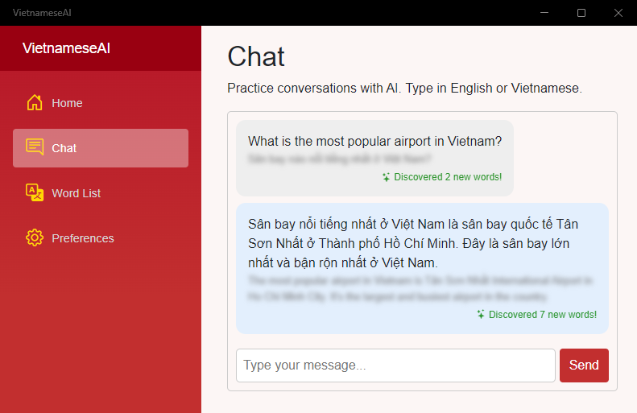

# VietnameseAI

.NET MAUI project that uses OpenAI to help the user practice conversational Vietnamese.  Words are added to the word list as they are discovered through the chat.

## Setup

Add your OpenAI key in the preferences screen or set as the `OpenAI__ApiKey__VietnameseAI` environment variable on Windows.

## Technology

- .NET MAUI Blazor Hybrid
- Microsoft Semantic Kernel
- OpenAI Structured Output
